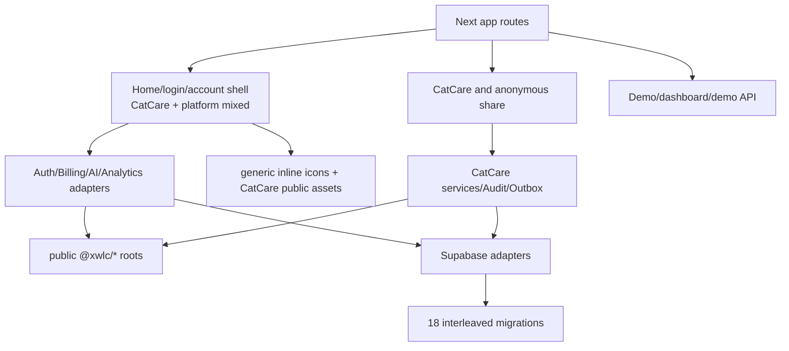
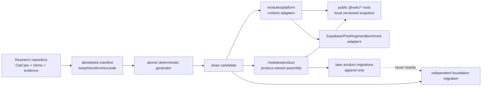

# Engineering Spec: Clean Template Extraction Boundary

## 2026-07-14 GNE-302 Strengthening Contract

The first candidate generation proved extraction but did not yet prove a
durable multi-product operating model. Before GNE-302 returns to Done, the
implementation must additionally provide:

- a checked `template/source-map.json` mapping research capability sources to
  curated neutral projections, with a CI drift gate that fails whenever a
  source hash changes before projection review;
- candidate-owned `product.config.json`, `product-state.json`, portable
  validation/generation, `pnpm product:init`, and `pnpm product:verify`;
- a thin `/product` route that composes a real `modules/product` workspace;
- one capability registry shared by pages, tests and environment validation;
- real neutral consumers for retained UI, owner cache, tag invalidation and
  targeted path refresh;
- non-overridable Analytics `product_id`, `app_environment`,
  `template_version`, and `release_version` dimensions;
- Supabase publishable-key preference, `getClaims()` protection,
  cookie/cache-header forwarding, pgTAP CI and immutable Billing retention;
- deployment CSP without `unsafe-eval` and existing header/return-path tests.

Generic logical deletion remains a design contract plus provider-free active/
historical-label helpers, not a speculative universal table or persistence
policy. Maps, uploads, search, a module marketplace, package registry,
cross-repository upgrades, and single-consumer Outbox/Audit extraction remain
trigger-based work after a real second consumer exists.

## Scope And Baseline

This is the binding GNE-301 architecture for GNE-302 implementation and
GNE-303 verification. It is documentation-only: no runtime file, migration,
database, generated candidate, or external repository is changed here.

Verified source baseline:

| Item | Current `main` fact |
| --- | --- |
| Source commit | `596286a1ddbf9f189e74c026e786157031aaffa5` |
| App Router files | 103 |
| Files below `app/catcare` | 59 |
| Anonymous share route files | 3 |
| Demo/dashboard/demo-API files | 11 |
| App components | 9; generic and CatCare concerns are mixed |
| App library files | 78; 36 are below `lib/catcare` |
| Public assets | 142; all are below `public/catcare` |
| Workspace packages | `core`, `ui`, `platform`, `db`, version `0.1.1` |
| Repository migrations | 18, ending at `20260713092452_catcare_soft_delete_plan_participants.sql` |
| Source license | root MIT license; no repository `THIRD_PARTY_NOTICES.md` yet |

Counts are inventory aids, not acceptance by themselves. GNE-302 must rerun the
inventory against its source commit and fail if an unclassified new path is
found.

## Current Directory

```text
ai-web-starter-kit/
├── apps/web/
│   ├── app/
│   │   ├── page.tsx, login/, account/       # platform capability + CatCare shell/copy mixed
│   │   ├── auth/, api/ai, api/payment       # platform/provider routes
│   │   ├── catcare/, s/[token]/             # Reference Product
│   │   ├── reference-product/               # CatCare compatibility redirect
│   │   └── demo/, dashboard/, api/demo-items# Foundation Demo
│   ├── components/                          # generic + CatCare components mixed
│   ├── lib/
│   │   ├── services, supabase, providers, analytics, i18n
│   │   └── catcare/                         # product service/repository/Audit/Outbox
│   └── public/catcare/                      # all current public assets
├── packages/core|ui|platform|db/
├── supabase/migrations/                     # generic, Demo, CatCare history interleaved
├── supabase/tests/
├── specs/                                   # stable specs + Reference Product evidence
├── context/                                 # stable rules + long execution history
├── integrations/
├── .github/ .codex/ scripts/
└── AGENTS.md README.md LICENSE
```

## Current Architecture



Confirmed coupling that GNE-302 must remove before generation:

- `/` imports `CatCareBrand`, CatCare hero/pricing components, and routes the
  signed-in CTA to `/catcare`;
- `/login` imports CatCare brand, hero, and product icons, and defaults unsafe or
  absent `next` to `/catcare`;
- `account/account-shell.tsx` renders `CatCareAppShell` and reads CatCare copy;
- `workspace-nav.tsx` combines generic and CatCare navigation/icon imports;
- `site-footer.tsx` imports CatCare brand and CatCare routes;
- the first data migration combines reusable `user_profiles` with Demo-only
  `demo_items`, so it cannot be copied as a candidate baseline;
- Audit and Outbox schemas contain CatCare event/resource unions and therefore
  are product evidence, not generic foundation schema.
- `packages/core/src/api.ts` and `data.ts` export Demo DTOs, validators, and
  table names from the public root; `packages/platform` contains Travel and
  CatCare fixture terminology. Package directories therefore require file-level
  transforms and cannot be copied as atomic `Keep` inputs.
- `packages/core/src/billing.ts` also owns a concrete Free/Plus/Pro catalog,
  prices, quotas, product feature keys and validation/demo copy; `@xwlc/ui`
  hard-codes an XWLC `BrandMark`. The candidate must move the catalog/brand to
  product configuration rather than treating current package output as neutral.
- the current app build also depends on `proxy.ts`,
  `instrumentation-client.ts`, app package/config files, and the Supabase
  config/seed/tooling files; omitting them from an allowlist would make cold
  generation incomplete.

## Target Research Repository

GNE-302 may reorganize only when needed to make generation and dependency
direction enforceable. The approved target is:

```text
ai-web-starter-kit/
├── apps/web/
│   ├── app/                              # thin Next routes
│   ├── modules/
│   │   ├── platform/                    # neutral app composition and runtime adapters
│   │   ├── reference-product/catcare/   # CatCare product code
│   │   └── examples/demo/               # Demo-only code
│   ├── config/
│   │   ├── app.config.ts
│   │   └── active-product.ts
│   └── public/
│       ├── reference-product/catcare/
│       └── examples/demo/
├── packages/core|ui|platform|db/
├── supabase/
│   ├── migrations/                      # existing 18-file history unchanged
│   └── blueprints/
│       ├── platform/
│       ├── reference-product/catcare/
│       └── examples/demo/
├── template/
│   ├── manifest.json
│   ├── generate/
│   └── verify/
├── specs/template|platform|reference-product/
└── context/ integrations/ .github/ .codex/ scripts/
```

This is a responsibility layout, not a requirement to move every file. Thin
route colocation and small same-route components may stay under `app` when the
dependency check still proves platform/product isolation. Directory cosmetics
must not create a broad rename without an ownership or generator benefit.

## Target Candidate

```text
xwlc-web-starter-template/
├── apps/web/
│   ├── app/                              # neutral home/login/account/auth/api/product
│   ├── modules/platform/
│   ├── modules/product/                  # one product placeholder
│   ├── config/app.config.ts
│   ├── config/product.config.ts
│   ├── public/product/
│   └── vercel.json                       # sole candidate deployment config
├── packages/core|ui|platform|db/         # version-stamped local snapshots
├── supabase/
│   ├── config.toml                        # neutral local identity/ports/Auth URLs
│   ├── seed.sql                           # empty or deterministic neutral seed
│   ├── .gitignore README.md
│   └── migrations/<timestamp>_foundation_baseline.sql
├── specs/_template/
├── context/ integrations/ .github/ .codex/ scripts/
├── AGENTS.md README.md .env.example
├── LICENSE THIRD_PARTY_NOTICES.md
├── template-version.json
├── pnpm-lock.yaml pnpm-workspace.yaml package.json turbo.json
└── .gitignore .editorconfig
```

The generated product repository keeps the same shape and replaces only
`modules/product`, product configuration, product assets, and product-owned
migrations/specs. `products/` plural is forbidden because one repository maps
to one product and one independent deployment.

## Target Architecture



## Dependency Direction

Allowed:

```text
app routes -> modules/platform
app routes -> modules/product
modules/product -> public @xwlc/* roots
modules/product -> modules/platform public app facade
modules/platform -> public @xwlc/* roots
platform -> core/db
ui -> core
db -> core
```

Forbidden:

```text
packages/* -> modules/product or CatCare/Demo
modules/platform -> CatCare/Demo DTO, event union, route, table, copy, or asset
modules/product -> package internal path
browser code -> server-only adapter or service key
candidate -> source absolute path, source worktree, source node_modules, or source cache
```

## Generator And Manifest Contract

GNE-302 implements an allowlist-driven generator; it must not copy the
repository and delete blocked strings afterward. Every manifest entry contains:

```json
{
  "source": "apps/web/lib/services/auth.ts",
  "target": "apps/web/modules/platform/auth/service.ts",
  "classification": "transform",
  "owner": "platform-app",
  "productEditable": false,
  "action": "copy-transform",
  "verification": ["no-catcare-import", "typecheck"],
  "provenance": { "sourceCommit": "<sha>", "templateVersion": "<version>" }
}
```

Supported classifications:

- `keep`: byte-preserving copy after secret/cache checks;
- `transform`: deterministic named transform with before/after verification;
- `exclude`: fail generation if copied;
- `contract_only`: document the pattern and trigger, copy no runtime code;
- `not_run`: retain an explicit unverified capability statement, never a ready
  claim.

The manifest is exhaustive for candidate inputs. An unclassified source file is
an error. Output must be created in an empty directory, written through a
temporary directory, verified, and atomically promoted. A failed run removes or
marks the incomplete temporary output and never looks complete.

`template-version.json` must record at least:

- template version and reproducible source timestamp;
- source repository and full source commit;
- generator/manifest version;
- four package names and versions;
- dependency lockfile hash;
- foundation migration filename and schema version;
- enabled/disabled provider modes;
- license/notices inventory version.

The source timestamp is the source commit time (or another manifest-pinned
constant), never the generator wall clock. Generated timestamps and random
identifiers must be omitted or normalized when they are not product inputs so
identical source/config runs compare equal.

Every candidate runtime/toolchain input is explicit: root package/workspace/
Turbo/lock files; app `package.json`, TypeScript, Next, Tailwind and PostCSS
configuration; `proxy.ts`; `instrumentation-client.ts`; root `vercel.json`;
Supabase config, seed, ignore file, README and baseline; CI, scripts, env example,
docs and orchestration files. The manifest fails on a new unclassified input.

## Route And App Mapping

| Current source | Classification | Candidate target/action |
| --- | --- | --- |
| `app/page.tsx` | Transform | neutral configured home, no CatCare import or `/catcare` default |
| `app/login/*` | Transform | retain Auth form/action; neutral shell and configured safe default path |
| `app/auth/confirm` | Keep/Transform | retain confirmation adapter; configured safe return |
| `app/account/page.tsx`, profile/action | Transform | retain profile behavior behind neutral account shell |
| `app/account/billing`, `usage` | Transform | neutral platform page; product pricing/copy and CatCare components excluded |
| `app/account/payment`, `api/payment` | Transform | sandbox/disabled application adapter, no live claim |
| `app/api/ai/text` | Transform | mock/no-op/disabled adapter and Billing gate |
| `app/catcare/**`, `app/s/**` | Exclude | Reference Product only |
| `app/reference-product/**` | Exclude | compatibility redirect only |
| `app/demo/**`, `app/dashboard/**`, `app/api/demo-items/**` | Exclude | Demo only |
| `app/globals.css`, `layout.tsx`, `icon.svg` | Transform | neutral tokens/metadata; system font stack only unless licensed asset added |

## Component And UI Mapping

| Current source | Classification | Rule |
| --- | --- | --- |
| `@xwlc/ui` public exports | Keep/Transform | retain neutral primitives; make `BrandMark` fully props/config-driven or compose it in app layer, with compatibility review |
| `components/app-icons.tsx` | Transform | split/include only candidate-consumed generic inline SVGs; Cat/Bowl/care semantics excluded |
| `account-menu`, `language-switcher`, `sign-out-button` | Transform | neutral route/config and app facade imports |
| `workspace-nav`, `site-footer` | Transform | configuration-driven; remove CatCare imports/routes/copy |
| `catcare-brand`, `catcare-icons`, `catcare-ui` | Exclude | product UI/assets |
| `public/catcare/**` | Exclude | 142 product assets and their generated/prototype sources |

The default system font stack can be kept without bundling a font binary. Any
future bundled font or image requires source, license, modification, and
redistribution entries in `THIRD_PARTY_NOTICES.md`.

## Service And Provider Mapping

| Current source | Classification | Candidate ownership |
| --- | --- | --- |
| `lib/services/auth.ts`, `lib/supabase/**` | Transform | `modules/platform/auth` and Supabase adapter |
| `lib/services/billing*`, `payment.ts`, `ai*` | Transform | platform app adapters consuming `@xwlc/core`; sandbox/mock/no-op defaults |
| `lib/analytics/**`, provider catalog/server | Transform | platform analytics/provider adapters; optional safe no-op |
| `lib/access/share-token-gate.ts`, `lib/capabilities/**` | Keep/Transform | app facade over public `@xwlc/platform`; no CatCare policy |
| `lib/i18n*` | Transform | neutral dictionaries with product configuration slots |
| `lib/services/demo-items.ts` | Exclude | Demo only |
| `lib/catcare/**` | Exclude | product services, DTOs, policy, Audit, Outbox, Analytics |

## Product Entity Lifecycle Contract

CatCare's soft-delete implementation remains Reference Product code and is not
copied into the candidate. The reusable foundation value is a design contract:

- a mutable business entity that is referenced by published, executed, billed,
  audited, or otherwise immutable facts is archived/tombstoned by default, not
  hard-deleted from user actions;
- active lists, selectors, mutable children, files and direct routes hide or
  reject archived entities;
- immutable history keeps stable snapshots needed to explain the fact and shows
  an explicit localized deleted marker such as `（已删除）` instead of silently
  reviving the entity or losing the historical name;
- archival and fact creation serialize or otherwise close races; authorization,
  audit and idempotency remain product-owned;
- physical purge is a separately approved retention/privacy operation with an
  impact analysis, not a renamed delete button.

This contract is emitted into the candidate's product engineering-spec template
as `contract_plus_pure_helpers`. GNE-302 retains only `ArchivableRecord`, active
filtering and historical deleted-label helpers; it adds no generic table, API,
hook, UI policy or cascade rule. A shared persistence implementation is
considered only when a second real product has the same mutable-entity/
immutable-fact relationship and would otherwise duplicate the semantics.

## Foundation Database Baseline

GNE-302 must first run the installed CLI help and create the file with:

```text
supabase --version
supabase migration --help
supabase migration new foundation_baseline
```

The resulting candidate history is independent. Do not invent a filename, copy
the 18 files, rename them, or insert their versions into the candidate migration
ledger.

Candidate final-state contents:

- `public.set_updated_at()` with fixed `search_path` and only required EXECUTE;
- `public.user_profiles` with owner-only SELECT/INSERT/UPDATE and matching
  `USING`/`WITH CHECK`;
- generic Billing orders, subscriptions, entitlements, Credit ledger, and usage
  ledger required by the retained pages;
- service-only `payment_events` with RLS enabled, no public policy, and explicit
  service-role grants;
- indexes, unique/idempotency constraints, triggers, RLS, and grants required by
  those retained objects;
- final Credit-unit schema semantics, folded into definitions rather than a
  historical data rewrite;
- no seed or only deterministic neutral configuration seed.

The migration filename is the database ledger version. `template-version.json`
records a human-readable schema version and that filename. Add no runtime
schema-version table until a real runtime consumer requires it.

All exposed tables use RLS. `TO authenticated` is never sufficient without an
owner predicate. UPDATE requires both `USING` and `WITH CHECK`. Authorization
does not use user-editable metadata. Views use `security_invoker` or are kept
out of exposed schemas. `SECURITY DEFINER` is not used as a permission shortcut.

The full 18-file disposition is binding in `extraction-manifest.md`.

### Foundation RLS And Grant Matrix

The baseline and its tests must pin permissions per object and operation; a
generic "owner isolation" assertion is insufficient.

| Object | `anon` | `authenticated` | `service_role` | Required policy/grant behavior |
| --- | --- | --- | --- | --- |
| `user_profiles` | no access | SELECT/INSERT/UPDATE own row only; no DELETE | full operational access | explicit grants; owner predicate on SELECT/INSERT and both UPDATE `USING`/`WITH CHECK` |
| `billing_orders` | no access | SELECT own rows only; no INSERT/UPDATE/DELETE | full operational access | owner SELECT policy; all write grants revoked from public roles |
| `billing_subscriptions` | no access | SELECT own rows only; no INSERT/UPDATE/DELETE | full operational access | owner SELECT policy; all write grants revoked from public roles |
| `billing_entitlements` | no access | SELECT own rows only; no INSERT/UPDATE/DELETE | full operational access | owner SELECT policy; all write grants revoked from public roles |
| `billing_credit_ledger` | no access | SELECT own rows only; no INSERT/UPDATE/DELETE | full operational access | immutable owner-readable facts; public-role writes revoked |
| `billing_usage_ledger` | no access | SELECT own rows only; no INSERT/UPDATE/DELETE | full operational access | immutable owner-readable facts; public-role writes revoked |
| `payment_events` | no access | no access | full operational access | RLS enabled, no anon/auth policy or grant |
| `set_updated_at()` | no direct EXECUTE | no direct EXECUTE | only if operationally required | fixed empty `search_path`; revoke EXECUTE from `PUBLIC`, `anon`, and `authenticated`; trigger invocation only |

Every retained public-schema table has RLS enabled and explicit REVOKE/GRANT.
Tests exercise every table as anon, owner A, owner B and service role for each
applicable SELECT/INSERT/UPDATE/DELETE operation. Ownership transfer, ordinary
user writes to Billing facts, and every public-role access to `payment_events`
must fail.

## Security And Commercial Acceptance

The candidate must verify:

- no `.env.local`, raw token, secret, key, database password, customer data,
  environment/project ID, cache, Git/worktree metadata, or private evidence;
- CSP including `frame-ancestors`, Referrer-Policy, X-Content-Type-Options, and
  appropriate secure session-cookie behavior;
- safe local return paths for login, confirmation, account, and provider flows;
- dependencies pinned by the lockfile and attributable in notices;
- external dependencies in generated package manifests use exact resolved
  versions and the committed lockfile; workspace dependencies remain local;
- GitHub Actions are pinned to immutable commit SHAs with a nearby human-readable
  version comment, unless an explicit supply-chain risk decision documents a
  temporary tag exception;
- included assets licensed for redistribution;
- Provider absence fails closed or renders disabled, never fabricated success;
- Analytics remains observational and excludes prompt/result/private payloads.

## GitHub, Vercel, And Database Gates

The research repository may complete its normal GNE-301 branch, commit, PR, CI,
review, and merge flow. Its existing automatic main deployment is an allowed
repository side effect, not evidence that an independent candidate deployed.
This Issue does not create or write a candidate/Smoke GitHub repository,
create/configure a Vercel project, manually deploy, or write any database.

The candidate follows Vercel's Turborepo application-directory model documented
at <https://vercel.com/docs/monorepos/turborepo>:

- Vercel Root Directory is fixed to `apps/web` and access to workspace files
  outside that directory is enabled;
- Framework Preset is `Next.js`;
- the sole config is `apps/web/vercel.json`; root `vercel.json` is excluded;
- Install Command is `cd ../.. && pnpm install --frozen-lockfile`;
- Build Command is
  `cd ../.. && pnpm turbo run build --filter=@xwlc/web`;
- Output Directory is `.next`, relative to `apps/web`;
- `turbo.json` declares `.next/**` and excludes `.next/cache/**` for the web
  build output before independent deployment acceptance.

GNE-303 must compare the dashboard settings with this contract and verify the
deployed commit and output. A different root or command is a reviewed manifest
change, not a dashboard-only adjustment.

GNE-303 may perform a new external repository or Vercel test-project operation
only with explicit approval for that target. Production deployment, Production
database migration, real secrets, real payment, and real AI remain forbidden
without their separate gates.

## GNE-302 Implementation Order

1. Re-run inventory and lock the manifest source commit.
2. Add dependency/boundary negative checks before moving code.
3. Neutralize app configuration and the home/login/account consumers.
4. Isolate CatCare and Demo dependency directions with one writer.
5. Build the platform blueprint and independent foundation migration.
6. Implement deterministic generation and pollution checks.
7. Generate into an isolated clean directory and run targeted checks.
8. Regression-test CatCare/Demo in the research repository.
9. Stop after GNE-302 acceptance; GNE-303 performs independent smoke.

## Architecture Acceptance

- current facts and coupling are traceable to the source commit;
- target directories express one product per repository;
- every candidate input is allowlisted and has an owner/action/check;
- product code never enters packages or platform modules;
- database history and candidate baseline are explicitly different ledgers;
- package snapshots have provenance without a distribution claim;
- UI, asset/license, security, Provider, external-operation, and future-trigger
  boundaries are testable rather than prose-only.
